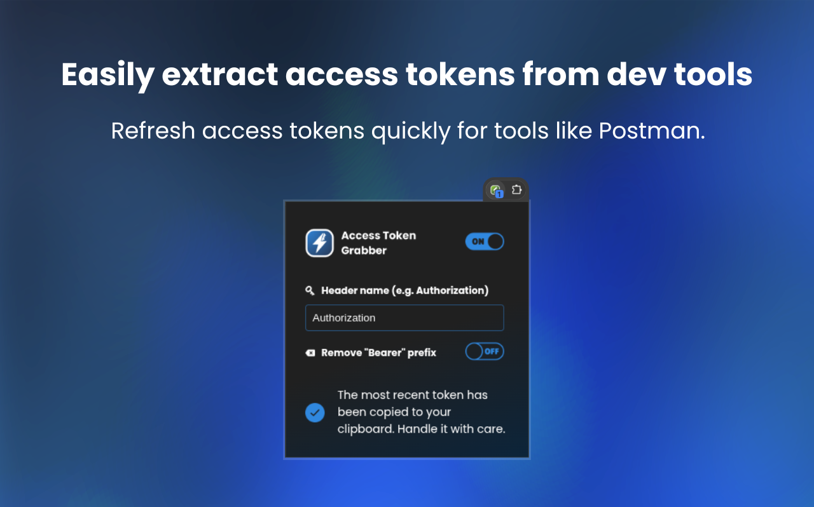
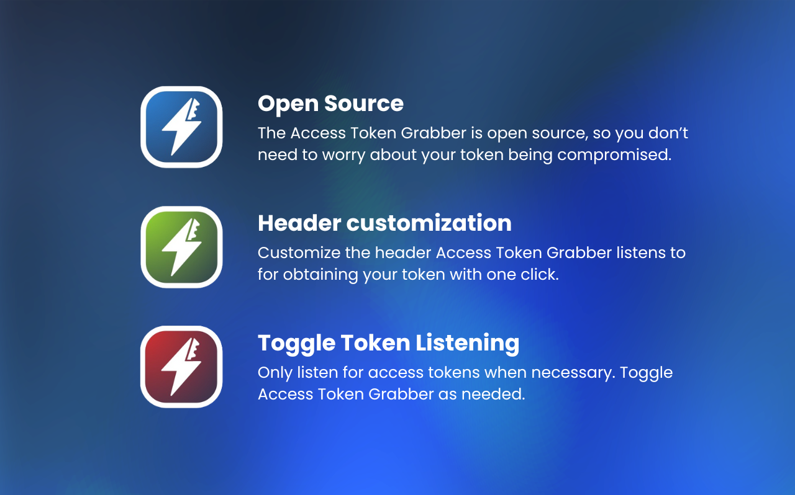

# Access Token Grabber Chrome extension 


Introducing the quickest and easiest way to retrieve your web request access token. Say goodbye to the hassle of digging through dev tools! This open-source extension streamlines the process, letting you grab your access token effortlessly and transparently.




# Project setup

## Development
Install the dependencies using
```
npm install
```

Run dev build with hot reload 
```
npm run watch
```

Go to `chrome://extensions/` in Chrome / Chromium. Enable **Developer Mode** on the top right. Click on **Load unpacked** and select the project's **dist** folder. 

## Production

Create a production build
```
npm run build
```